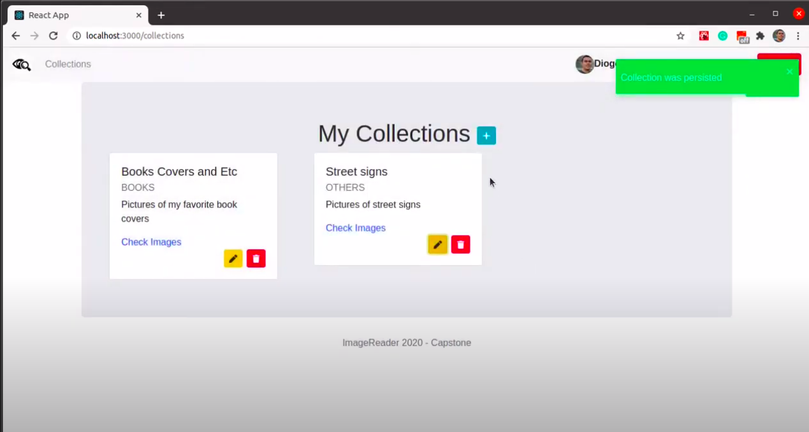
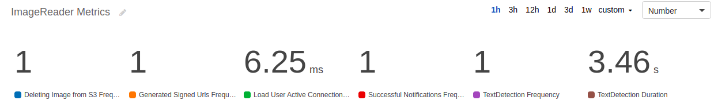

# Cloud Developer Nanodegree Capstone

This project was developed in fulfillment of Cloud Developer Nanodegree Capstone.

## Image Reader

This project consists of a serverless backend and frontend that allows users to create and manage image collections. It also has an extra feature of text detection by Amazon Rekognition services.

### Demo
[](https://youtu.be/alo1_R846yw "Image Reader Demo")

### Stack

**Serverless Backend**

* Serverless Framework
* Auth0 Authentication
* NodeJS 12 + Typescript 4
* DynamoDB
* S3
* API Gateway + Lambdas
  * Web API for user operations
  * WebSocket for notifications
* Rekognition
  * Text detection only

**Frontend**

* React 16 + Typescript 4
* Auth0 Authentication React SDK
* Bootstrap 4

### Metrics

Some metrics are collected for specific operations, such as:

* Frequency / Count
  * Deleting Image from S3
  * Generated Signed Urls
  * Successful Notifications
* Duration
  * Load User Active Connections
* TextDetection
* TextDetection Duration



### Running

#### Serverless Backend
For a clean environment / account, just run serverless deploy command with your credentials with enough permissions:

```shell
$ sls deploy -v
```

#### Frontend

Run `client` project as is to point to the actual deployed project:

```shell
$ cd client/
$ yarn start
```

In case of a fresh / new serverless environment, change the configuration file to point to your new APIs IDS and Auth0 configuration:

`client/config/config.ts`
```javascript
const apiId = 'YOUR_APIID_HERE'
const wsId = 'YOUR_WSAPIID_HERE'

export const apiEndpoint = `https://${apiId}.execute-api.us-east-1.amazonaws.com/dev`
export const wsEndpoint = `wss://${wsId}.execute-api.us-east-1.amazonaws.com/dev`

export const authConfig = {
  domain: 'YOUR_AUTH0_DOMAIN',
  clientId: 'YOUR_CLIENT_ID',
  callbackUrl: 'YOUR_ROOT_CALLBACK_URL'
}
```

#### Postman Scripts

Check postman scripts / environment  or the Image Reader API.

Token can be obtained from localStorage.
